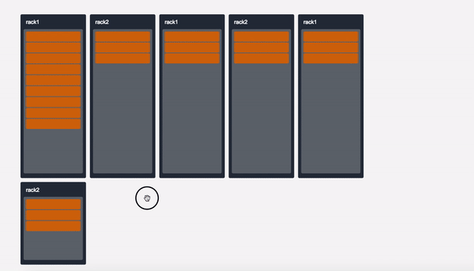
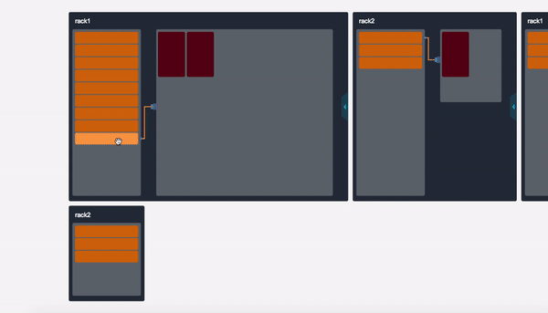

# omg.js
[](https://travis-ci.org/PengJiyuan/omg)
[![][npm-image]][npm-url]
[![][downloads-image]][downloads-url]

Oh my goodness! Awesome Canvas Render Library. 

[Demo](https://omg.js.org)

[中文文档](README.md)

<div align=center>
  
</div>

<div align=center>
  
</div>

## Install

**NPM**    

`npm i omg.js`

**CDN**

https://unpkg.com/omg.js@4.0.0/dist/omg.min.js (you can edit @version to change omg.js version)

**DOWNLOAD**

[Source Code](dist/omg.min.js)

## Usage

* node

```javascript
import omg from 'omg.js';

const stage = omg({
  ...
});

// Init
stage.init();
```

* broswer

```html
<script src="yourpath/omg.min.js"></script>
<script>
  var stage = omg({
    ...
  });
  stage.init();
</script>
```

## Example

```javascript
import omg from 'omg.js';

const stage = omg({
  element: document.getElementById('canvas'),
  width: 500,
  height: 500,
  enableGlobalTranslate: true,
  enableGlobalScale: true,
  position: 'absolute', // canvas.style.position
  images: [], // preload image list
  prepareImage: true, // whether to preload images
  // or
  prepareImage: () => {
    hideLoading(); // will called after images loaded.
  }
});

// before init, you can expand your custom graphs.
stage.init();

const rect = stage.graphs.rectangle({
  x: 120,
  y: 120,
  width: 200,
  height: 200,
  color: '#'+(~~(Math.random()*(1<<24))).toString(16)
}).on('mousedown', function() {
  console.log('click rect2');
}).on('mouseenter', function() {
  rect.color = '#'+(~~(Math.random()*(1<<24))).toString(16);
  stage.redraw();
}).on('mouseleave', function() {
  rect.color = '#'+(~~(Math.random()*(1<<24))).toString(16);
  stage.redraw();
}).on('dragin', function() {
  console.log('drag in rect2');
  rect.color = '#ffffff';
  stage.redraw();
}).on('dragout', function() {
  console.log('drag out rect2');
  rect.color = '#'+(~~(Math.random()*(1<<24))).toString(16);
  stage.redraw();
}).on('drop', function() {
  console.log('you drop on the rect2!');
  rect.color = '#000';
  stage.redraw();
}).config({
  drag: true,
  changeIndex: true
});

// add graphs to drawing list.
stage.addChild(rect);

// draw and trigger events.
stage.show();
```

### Graphs

**Rectangle**

```javascript
const rect = stage.graphs.rectangle({
  x: 0,
  y: 0,
  width: 110,
  height: 110,
  rotate: 45, // not work when define radius
  radius: {
    tl: 6, // top left
    tr: 6, // top right
    bl: 6, // bottom left
    br: 6 // bottom right
  },
  color: '#514022'
});
```

**Line & Polyline**
```javascript
const polyline = stage.graphs.line({
  matrix: [
    [10, 180],
    [40, 50],
    [80, 180],
    [90, 80],
    [110, 100],
    [140, 50],
    [260, 180]
  ]
});
```

**Polygon**
```javascript
const polygon = stage.graphs.polygon({
  matrix: [
    [310, 120],
    [360, 120],
    [348, 230],
    [250, 340],
    [146, 200]
  ],
  color: 'black',
  style: 'stroke',
  lineWidth: 4
});
```

**Image**

```javascript
const image = stage.graphs.image({
  x: 0,
  y: 0,
  width: 800,
  height: 500,
  src: './img/timg.jpg'
});

// For more detail, check canvas api.
const image3 = stage.graphs.image({
  x: 200,
  y: 200,
  width: 97,
  height: 110,
  sliceX: 5,
  sliceY: 0,
  sliceWidth: 97,
  sliceHeight: 110,
  src: './img/action.png'
});
```

**Text**

```javascript
const text = stage.graphs.text({
  x: 300,
  y: 40,
  width: 150,
  height: 40, // x, y, width, height指定了一个矩形， 文字就在其中
  paddingTop: 8, // 用于调整文字在矩形中的位置
  center: true,  // 文字居中
  background: {
    color: 'blue', // 背景颜色
    img: './img/text_bg.png' // 背景图片
  }, // 给文字添加背景颜色(矩形)
  font: 'italic bold 20px arial,sans-serif', // 文字样式
  text: 'Hello stage', // 文字内容
  color: '#fff', // 文字颜色
  style: 'fill' // fill -- 填充， stroke -- 描边
});
```

**Circle**

```javascript
const arc = stage.graphs.arc({
  x: 400,
  y: 400,
  radius: 30,
  color: 'rgba(255, 255, 255, 0.5)',
  style: 'fill' // fill -- 填充， stroke -- 描边
});
```

**Sector**

```javascript
const arcb = stage.graphs.arc({
  x: 130,
  y: 380,
  radius: 100,
  startAngle: 45,
  endAngle: 165,
  color: '#512854',
  style: 'fill'
});
```

### Hide Shapes
```javascript
const arcb = stage.graphs.arc({
  ...,
  hide: true
});

// or

arcb.hide = true;
```

### Expand Shapes

If the default shapes not enough, you can expand shapes simply.
Before stage init, just expand your shapes by function `extend`.


```javascript
const stage = omg({
  ...
});

// demo shape
const yourShape = function(settings, _this) {
  const draw = function() {
    const canvas = _this.canvas;
    const scale = _this.scale;

    // if you want trigger events(includes drag, scale, mousedown, mouseenter...), you must add this line.
    stage.ext.DefineScale.call(this, scale, 'moveX', 'moveY', 'matrix');

    const matrix = this.scaled_matrix;

    canvas.save();
    canvas.translate(this.scaled_moveX, this.scaled_moveY);
    canvas.beginPath();

    matrix.forEach((point, i) => {
      i === 0 ? canvas.moveTo(point[0], point[1]) : canvas.lineTo(point[0], point[1]);
    });
    canvas.lineTo(matrix[0][0], matrix[0][1]);
    
    canvas.fillStyle = this.color;
    canvas.fill();
    canvas.closePath();
    canvas.restore();
  };

  return Object.assign({}, stage.ext.display(settings, _this), {
    type: 'polygon',
    draw: draw,
    lineWidth: settings.lineWidth || 1,
    matrix: settings.matrix
  });
};

// Before init, extend your shapes.
stage.extend({
  yourShape: yourShape
});

stage.init();

// use your extend shape
const shape = stage.graphs.yourShape({
  ...settings
});

stage.addChild(shape);

stage.show();

```

### Add Event

#### global events

Global event (mousedown, mousemove) for whole omg.

```javascript
stage.mousedown(function(e) {
  console.log(stage.utils.getPos(e));
});

stage.mousemove(function(e) {
  console.log(stage.utils.getPos(e));
});
```

#### shape events

All pc event types supported:

* mousedown
* mouseup
* mouseenter
* mouseleave
* mousemove'
* drag
* dragend
* dragin
* dragout
* drop

All mobile event types supported:

* touchstart
* touchmove
* touchend
* tap

Support chain call.

```javascript
/*!
 * @cur: current shape.
 */
shape.on('mousedown', function( cur ) {
  console.log('you click rect');
}).on('mousemove', function( cur ) {
  console.log('you move!');
}).on('mouseleave', function( cur ) {
  console.log('you leave!');
}).drag(true).config(){...};
```

### config

```javascript
rect.config({
  zindex: 10,
  drag: true, // enable drag 
  changeIndex: true， // when drag, will change graphs' order
  fixed: true, // globalTranslate and globalScale is not work
});
```

### Group
You can insert some shapes into a group, so that then can behave consistency.
```javascript
const group = stage.group({
  x: 100,
  y: 100,
  width: 200,
  height: 200,
  title: {
    title: {
      text: 'Group Name',
      fontSize: 14,
      paddingTop: 12,
      paddingLeft: 14
    }
  },
  /**
   * @param {Object} background - group's background color
   * @TODO: support image
   * /
  background: {
    color: '#000',
    img: '/path/x.png' // TODO
  },
  /**
   * @param {Object} border - group's border
   * @TODO: support border width
   * /
  border: {
    color: '#000',
    lineWidth: 2 // TODO
  },
  zindex: 10
}).on('mousedown', function() {
  console.log('you clicked group');
});
```

* **Function** `group.add()`

Add child element to group.
The child element's coordinates will be referenced to the group's starting point.

* **Function** `group.remove()`

Remove an child element from group.

1. remove([Array])  -  remove shapes list
2. remove([Function])  -  remove group's children filter by function.

* **Function** `group.updateAllChildsPosition()`

update all group's children's position.

### Add shapes to stage.

```javascript
stage.addChild(rect);
stage.addChild(line);
stage.addChild(group);

// or

stage.addChild([rect, line, arc1, text1]);
```

### Remove shapes from stage.

```javascript
stage.removeChild(rect);

stage.removeChild([rect, arc, line]);

stage.removeFirstChild();

stage.removeLastChild();

stage.removeAllChilds();
```


### Show
Draw and trigger events.

```javascript
stage.show();
```

If you call function addChild or removeChild and bind some new events or unbind some events, you shold reset events trigger by:
```javascript
stage.show()
```
or
```javascript
stage.draw();
stage._events.triggerEvents();
```

### Draw and Redraw
```javascript
stage.draw();
stage.redraw();
```

### Reset
Reset OMG to init status.

```javascript
stage.reset();
```

### Animation

#### Global Animation

```javascript
function go() {
  rect.x++;
  line.y = line.y + 2;
  arc.radius++;
}

stage.animate(go);
```

#### Shap Animation

[Demo](https://omg.js.org/animation.html)

```javascript
/**
 * @param: {keys | Object}   -- the end value of your tween
 * @param: {config | Object} -- the tween settings
 */
shape.animateTo({
  x: 100,
  y: 100,
  width: 200,
  height: 200
}, {
  duration: 1000, //default = 500
  delay: 500, // defalut = 0
  easing: 'bounceOut', // defalut = 'linear'
  onStart: function(keys) {
    /**
     * @param: keys
     * the values during you tween
     * same below
     */
    console.log(keys.x, keys.y, keys.width, keys.height);
  }, // defalut = undefined
  onUpdate: function(keys) {
    console.log(keys.x, keys.y, keys.width, keys.height);
  }, // defalut = undefined
  onFinish: function(keys) {
    console.log(keys.x, keys.y, keys.width, keys.height);
  }, // defalut = undefined
});
```

#### Easing Types
* linear
* quadIn
* quadOut
* quadInOut
* cubicIn
* cubicOut
* cubicInOut
* quartIn
* quartOut
* quartInOut
* quintIn
* quintOut
* quintInOut
* sineIn
* sineOut
* sineInOut
* bounceOut
* bounceIn
* bounceInOut

#### Clear Animation
```javascript
stage.clearAnimation();
```

#### After Finish Animation
```javascript
stage.finishAnimation = () => {
  console.log('all animations has finished!');
};
```

### Resize

#### resize(opt)
* opt.width {Function} -- width after resize
* opt.height {Function} -- height after resize
* opt.resize {Function} -- callback triggered after resize

```javascript
world.resize({
  width: () => document.body.clientWidth,
  height: () => document.body.clientHeight,
  // function update - update the canvas size
  resize: (update) => {
    update();
  }
});
```

### FPS

#### fpsOn

If you use some animations and want to know the fps, just call function `fpsOn` to get fps.

```javascript
stage.fpsOn(function(fps) {
  console.log(fps);
});
```

#### Fps off
```javascript
stage.fpsOff();
```

## [CHANGELOG](./.github/CHANGELOG.md)

## [MIT](./LICENSE)

[npm-image]: https://img.shields.io/npm/v/omg.js.svg
[npm-url]: https://npmjs.org/package/omg.js
[downloads-image]: https://img.shields.io/npm/dm/omg.js.svg
[downloads-url]: https://npmjs.org/package/omg.js
